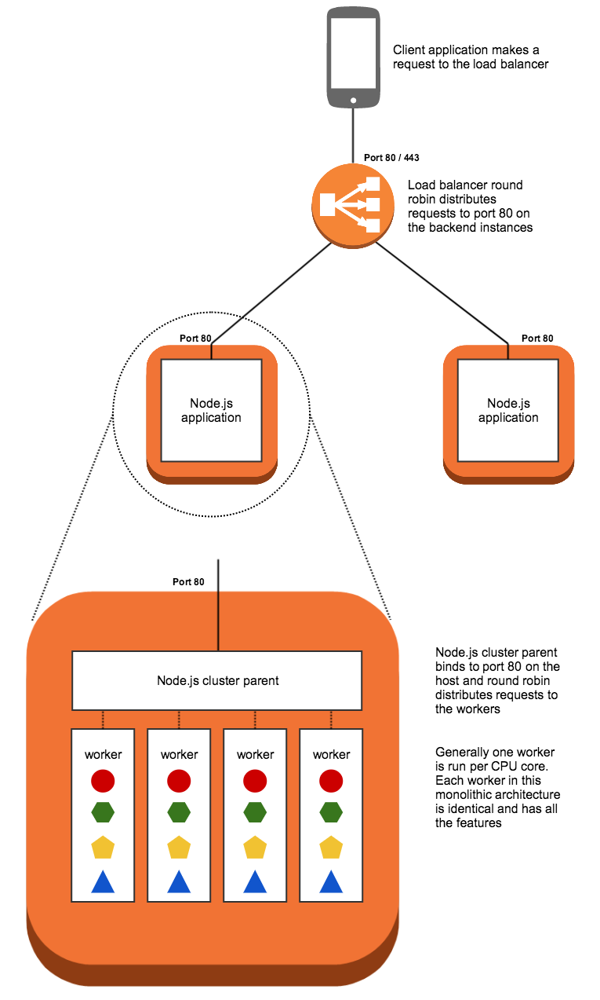

# nodejs-app
Simple NodeJS application

This is an example of a basic monolithic node.js service that has been designed to run directly on a server, without a container.

# Architecture

Since Node.js programs run a single threaded event loop it is necessary to use the node `cluster` functionality in order to get maximum usage out of a multi-core server.

In this example `cluster` is used to spawn one worker process per core, and the processes share a single port using round robin load balancing built into Node.js

We can use an Application Load Balancer to round robin requests across multiple servers, providing horizontal scaling.

# Deploy Monolith Application on EC2

## Pre-Requisite

## Launch EC2 server on AWS Cloud & Install NodeJS Software
1. Provision EC2 server & ssh to instance
2. Clone the code : git clone 
3. Install nodejs & npm

# Build & Deploy

## Download dependent module/library
Go to root directory of project & run below command, it will download all dependent library under node_module folder

### $ npm install 

## Start the node server by ruuning below command

### $ node server.js

# Access REST API

Get All User list : http://localhost:3000/api/users
Get All Thread list : http://localhost:3000/api/threads
